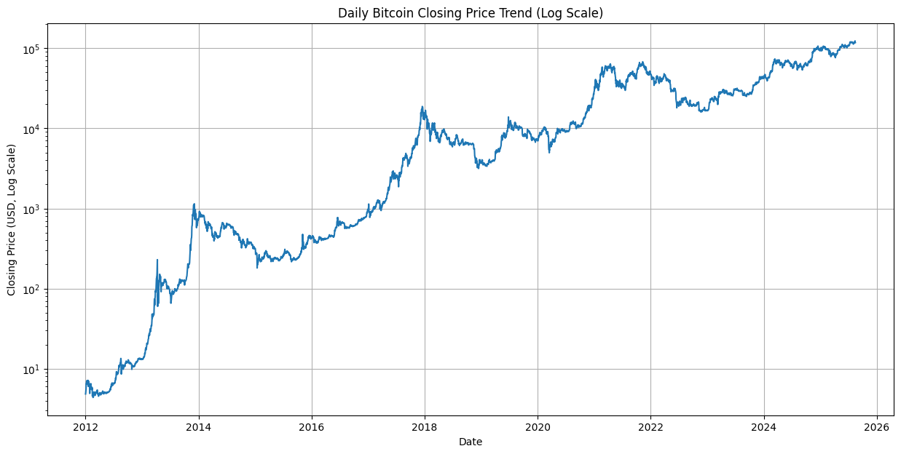
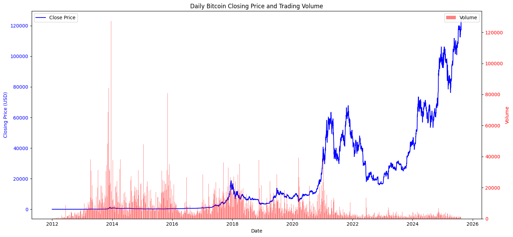
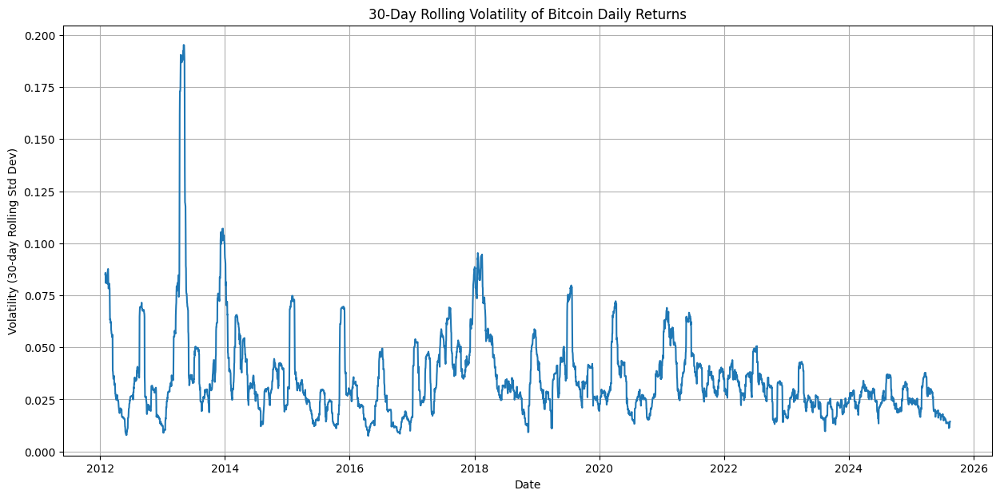
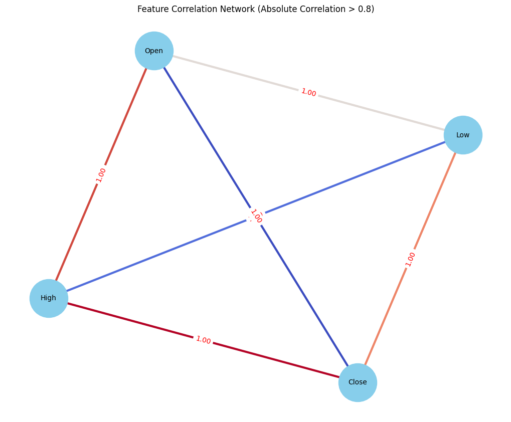
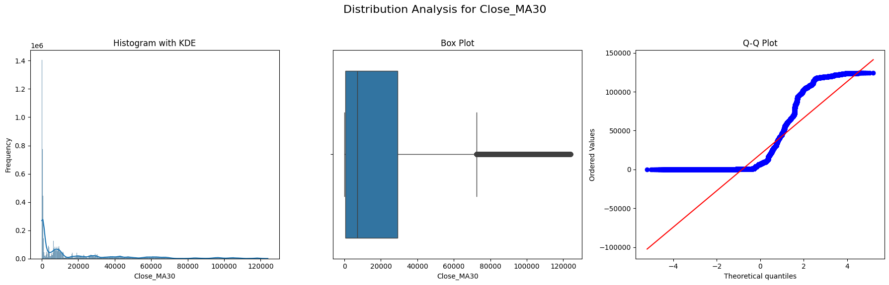
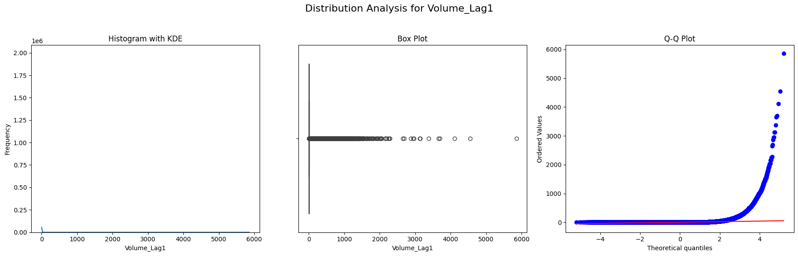
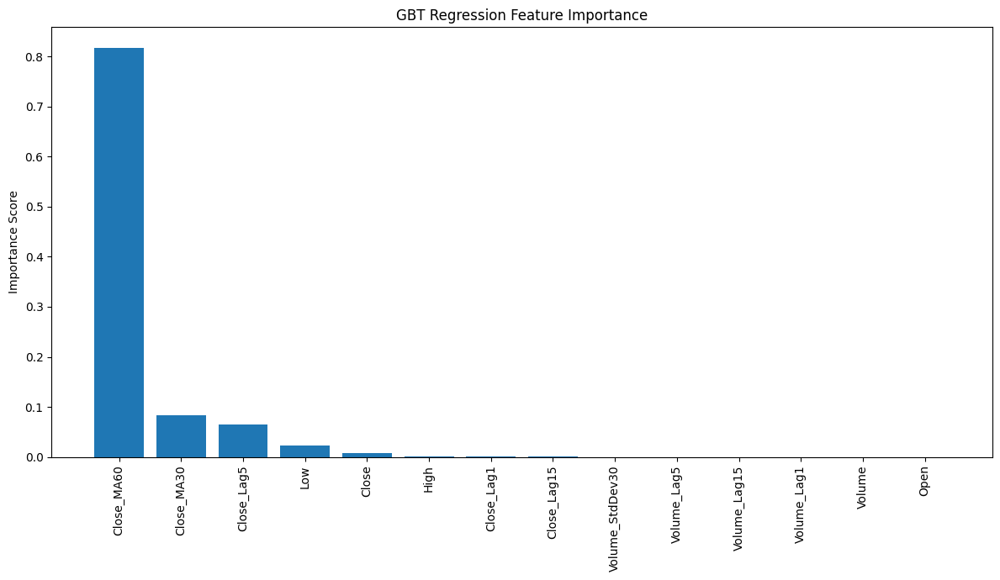
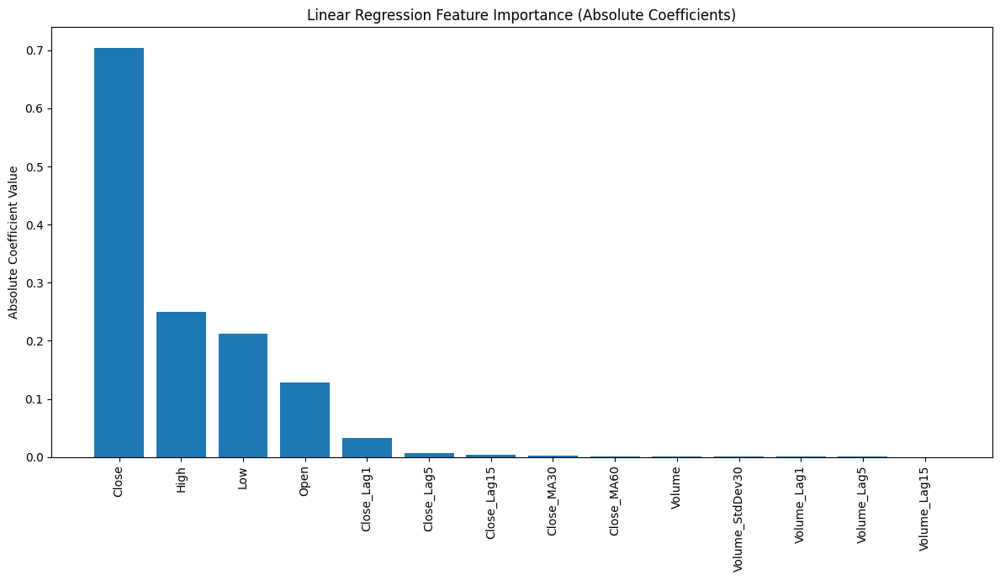
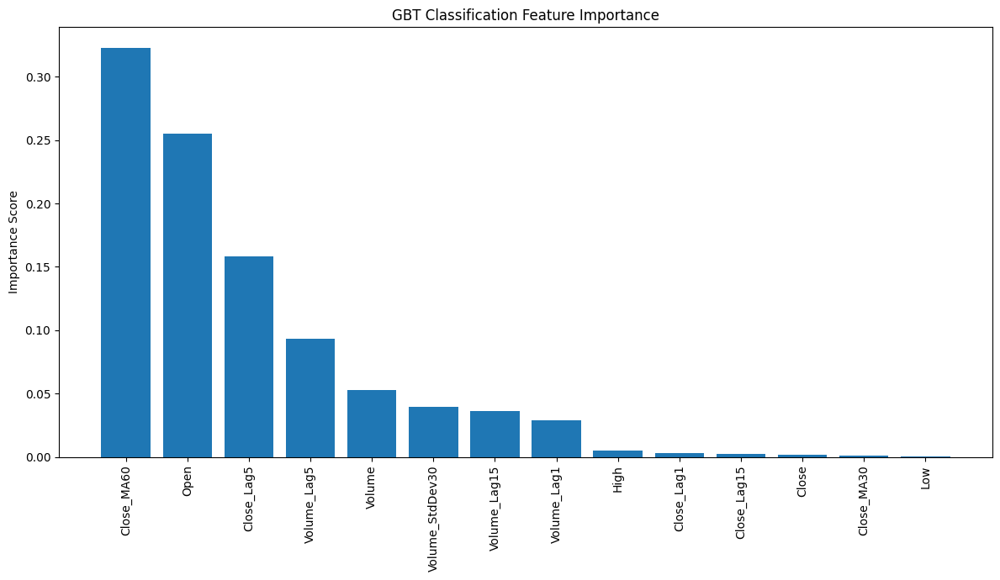

# 📘 PySpark Big Data Analytics Engine

**Notebook:** `pyspark-bigdata-analytics-engine.ipynb`

## Project Summary
This project performs large-scale data ingestion, preprocessing, feature engineering, and modeling using **PySpark**. The dataset contains **1-minute BTC/USD trading data** with fields such as `Open`, `High`, `Low`, `Close`, and `Volume`.

Key steps include:

- Loading data into a PySpark DataFrame
- Schema inference and validation (all inferred as `double`)
- Summary statistics and distribution inspection
- No null values found across columns
- Feature engineering (MA, Lag features, rolling metrics)
- Regression & classification modeling
- Feature importance evaluation
- Advanced visualizations & correlation network analysis

---

## Table of Contents
- [About](#about)
- [Repository Structure](#repository-structure)
- [Requirements](#requirements)
- [Setup and Run](#setup-and-run)
- [Notebook Overview](#notebook-overview)
- [Figures & Visualizations](#figures--visualizations)
- [Datasets](#datasets)
- [Reproducibility Tips](#reproducibility-tips)
- [License](#license)

---

## About
This repository demonstrates an end-to-end **big data analytics workflow** using PySpark.
It covers data processing, scalable computation, modeling, and rich visualizations for time-series cryptocurrency analytics.

---

## Repository Structure
```
/                - repository root
├─ pyspark-bigdata-analytics-engine.ipynb   - main notebook
├─ data/                                     - dataset storage (not included)
├─ figures/                                  - exported figures used in README
├─ requirements.txt                           - library dependencies
└─ README.md                                  - project documentation
```

---

## Requirements
Python libraries used in this project:

`matplotlib`, `networkx`, `numpy`, `pandas`, `pyspark`, `scipy`, `seaborn`

Install dependencies:

```bash
python -m venv venv
source venv/bin/activate     # macOS/Linux
venv\Scripts\activate        # Windows
pip install -r requirements.txt
```

---

## Setup and Run

```bash
git clone https://github.com/Saiful-Islam0/bigdata-pyspark-analytics-engine.git
cd bigdata-pyspark-analytics-engine
jupyter lab
```

Open the notebook and run all cells sequentially.

---

## Notebook Overview
The workflow includes:

- **Data ingestion & validation**
- **EDA with summary statistics**
- **Distribution analysis of engineered features**
- **Feature engineering** (lag features, moving averages, volatility)
- **Correlation & network visualization**
- **Regression & classification models**
- **Feature importance comparison (GBT vs Linear Regression)**
- **Model evaluation & interpretation**

---

# 📊 Figures & Visualizations

Below are all analysis and model-interpretation visuals included in the project.

---

### 📌 GBT Classification Feature Importance  


---

### 📌 Linear Regression Feature Importance  


---

### 📌 GBT Regression Feature Importance  


---

### 📌 Distribution Analysis — Volume_Lag1  


---

### 📌 Distribution Analysis — Close_MA30  


---

### 📌 Feature Correlation Network  


---

### 📌 30-Day Rolling Volatility of Bitcoin  


---

### 📌 Daily Bitcoin Price vs Volume  


---

### 📌 Bitcoin Price Trend (Log Scale)  


---

## Datasets
Dataset Source:
https://www.kaggle.com/datasets/mczielinski/bitcoin-historical-data

---

## Reproducibility Tips
- Use fixed versions in `requirements.txt`
- Document Spark version & configurations
- Include sample datasets for lightweight testing

---

## License
Licensed under the **MIT License**.
